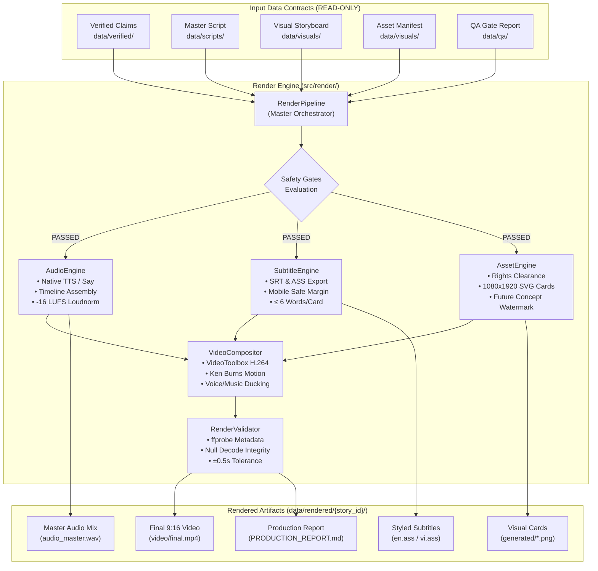

# AI NEWS FACTORY — Modular Production Render Engine

> **Document Version:** 1.0  
> **Target Format:** YouTube Shorts / TikTok (Vertical 9:16, 1080x1920 @ 30.0 fps)  
> **Status:** Production-Ready Build  
> **Engine Path:** `src/render/`

---

## 1. Executive Summary

The **AI NEWS FACTORY Modular Production Render Engine** is a deterministic, schema-governed multimedia rendering pipeline. It transforms verified research, short-form scripts, visual storyboards, asset manifests, and style directives into publication-grade vertical technical explainers without hard-coding story-specific logic.

### Core Philosophy
1. **Source & Fact Traceability:** No visual or audio cue is rendered without explicit mapping to verified claims (`fact_id`).
2. **Deterministic & Modular:** Every component (`audio`, `subtitles`, `assets`, `compositor`, `validation`) operates independently behind clean APIs and configuration interfaces.
3. **Safe-by-Default:** Rendering is blocked unless all non-negotiable safety gates pass (QA status, rights clearance, temporal accuracy, timeline synchrony).
4. **Zero Heavy Cloud Overhead:** Operates entirely on the local environment using macOS native capabilities (`/usr/bin/say`, VideoToolbox Apple Silicon GPU acceleration) and standard FFmpeg, with zero Remotion or Node.js runtime dependencies.

---

## 2. Architecture Overview



---

## 3. Modular Components Breakdown

### 3.1 `AudioEngine` (`src/render/audio.py`)
- **Voice Synthesis:** Synthesizes voice per shot segment using native macOS `/usr/bin/say` (`Samantha` for English, `Linh` for Vietnamese) or configured TTS backends.
- **Shot-Level Isolation:** Saves individual `.wav` files per shot (`shot-01.wav`, `shot-02.wav`) traceable to script IDs.
- **Timeline Assembly:** Places audio segments at exact script start offsets using FFmpeg `adelay` and `amix` with stereo 48kHz audio.
- **Loudness Normalization:** Automatically applies EBU R128 / ITU-R BS.1770 two-pass equivalent filter (`loudnorm=I=-16:TP=-1.5:LRA=11`) to ensure optimal mobile listening levels.
- **Dry-Run Mode:** Calculates spoken word counts, estimated words-per-minute (WPM), and timeline allocations without disk writes or synthesis invocation.

### 3.2 `SubtitleEngine` (`src/render/subtitles.py`)
- **Dual Format Support:** Authors standard `.srt` subtitles and Advanced SubStation Alpha (`.ass`) tracks for burn-in.
- **Visual Style Bible Compliance:**
  - Font: `Inter`, SemiBold/Bold, font size 42.
  - Colors: Primary `#F3F7FA` (`&H00FAF7F3`), Outline `#070A0F` (`&H000F0A07`), Accent `#4DEBFF`.
  - Margins: Bottom safe margin `MarginV=240` to avoid YouTube Shorts title/UI occlusion; lateral margin `MarginLR=80`.
- **Typographical Guardrails:** Enforces maximum 6 words per text card. Typographical divider characters (such as bullets `•` or vertical pipes `|`) are ignored to prevent false-positive word count violations.

### 3.3 `AssetEngine` (`src/render/assets.py`)
- **Deterministic Registry:** Parses storyboards and asset manifests into `asset_registry.json`.
- **Rights Clearance Gate:** Non-negotiable check that halts rendering if any third-party asset has status `RIGHTS_REVIEW_REQUIRED`, `UNKNOWN`, or `UNRESOLVED`.
- **Classification Taxonomy:** Rigorously tags assets as `OFFICIAL_SOURCE`, `SCREENSHOT`, `GENERATED`, `DIAGRAM`, `HYBRID`, `ILLUSTRATIVE`, or `FUTURE_CONCEPT`.
- **Watermark Enforcement:** Any shot or asset marked `FUTURE_CONCEPT` automatically receives an indelible, prominent on-screen badge:
  `FUTURE CONCEPT • NOT OPERATIONAL INFRASTRUCTURE`.
- **Procedural SVG Card Generator:** Generates native 1080x1920 vector cards with technical gridlines, cyan corner brackets, header branding (`AI NEWS FACTORY`), focal panel typography, and footer stamp (`AI TECH EXPLAINER • VERIFIED EVIDENCE FIRST`).
- **Rasterization:** Converts SVG to PNG at 1080x1920 using FFmpeg or Google Chrome headless.

### 3.4 `VideoCompositor` (`src/render/compositor.py`)
- **Hardware Acceleration:** Auto-detects Apple Silicon hardware encoder (`h264_videotoolbox`) for ultra-fast, energy-efficient rendering, falling back to CPU `libx264`.
- **Procedural Motion (Ken Burns):** Dynamically applies subtle, continuous zoom/pan motions (`zoompan=z='min(zoom+0.0006,1.06)'`) to maintain high visual retention on static cards.
- **Multi-Track Audio Ducking:** Mixes Voice $\rightarrow$ SFX $\rightarrow$ Music. Automatically attenuates background music by `-18 dB` whenever voiceover is active and applies smooth fadeouts.
- **Subtitle Burn-In:** Hardcodes styled `.ass` subtitles using FFmpeg's native libass filter (`subtitles=en.ass`).

### 3.5 `RenderValidator` (`src/render/validate_render.py`)
- **Technical Conformance Audit:** Inspects output `.mp4` using `ffprobe` to verify:
  - Resolution: Exactly 1080x1920 (9:16 vertical).
  - Framerate: 30.0 fps ($\pm 1.0$ fps).
  - Codecs: H.264 video, AAC stereo audio (48kHz).
  - Duration: Storyboard duration ($\pm 0.5$s tolerance).
- **Integrity Check:** Decodes the entire stream to `null` via FFmpeg to detect corrupt frames or macroblock dropouts.
- **Output:** Emits structured machine-readable `qa/render_validation.json`.

---

## 4. Safety Gates & Pre-Render Guardrails

The `RenderPipeline` will raise a runtime exception and refuse to render if any of the following gates fail:

| Gate | Criterion | Verification Rule |
| :--- | :--- | :--- |
| **G1: Artifact Completeness** | Script, Storyboard, Asset Manifest, QA Report, Traceability exist | All 5 input JSON files must be present and readable. |
| **G2: QA Authorization** | QA gate verdict | `status` must be `APPROVED_FOR_RENDER` or `PASS`. |
| **G3: Script Status** | Editorial approval | Script `status` must equal `PASS`. |
| **G4: Storyboard Status** | Visual director approval | Storyboard `status` must equal `PASS`. |
| **G5: Rights Clearance** | Intellectual property | Zero assets in manifest with `RIGHTS_REVIEW_REQUIRED`. |
| **G6: Timeline Synchrony** | Duration alignment | Script duration and Storyboard duration must match within $\le 0.5$s. |

---

## 5. Output Directory Structure

Each story render creates a dedicated, self-contained workspace under `data/rendered/<story-id>/`:

```
data/rendered/google-project-suncatcher-orbital-tpu-2026/
├── production.log                      # Complete timestamped execution log
├── PRODUCTION_REPORT.md                # Human-readable render summary
├── audio/
│   ├── shot_timing.json                # Voice timing per shot segment
│   ├── voice/                          # Synthesized shot wav files
│   │   ├── shot-01.wav ... shot-08.wav
│   │   └── voice_master.wav           # Normalized voice track (-16 LUFS)
│   └── mix/
│       └── audio_master.wav            # Master audio mix with ducking
├── subtitles/
│   ├── en.srt                          # Standard SubRip subtitles
│   ├── en.ass                          # Styled ASS subtitles (Inter, 1080x1920)
│   ├── vi.srt                          # Vietnamese SubRip subtitles (optional)
│   └── vi.ass                          # Vietnamese ASS subtitles (optional)
├── assets/
│   ├── asset_registry.json             # Deterministic asset catalog
│   ├── placeholders/                   # 1080x1920 vector SVG cards
│   │   └── shot-01_card.svg ... shot-09_card.svg
│   └── generated/                      # Rasterized 1080x1920 PNG cards
│       └── shot-01.png ... shot-09.png
├── video/
│   ├── clip_shot-01.mp4 ... clip_shot-09.mp4  # Individual motion clips
│   ├── concat_list.txt                 # FFmpeg concat demuxer file
│   └── final.mp4                       # Complete 1080x1920 30fps Short
└── qa/
    └── render_validation.json          # Post-render ffprobe audit report
```

---

## 6. CLI Reference

### 6.1 Dry-Run Inspection (Non-destructive)
Inspects safety gates, artifact resolution, duration calculations, and simulated FFmpeg commands without rendering or synthesizing files:
```bash
./.venv/bin/python3 -m src.render.render_pipeline \
  --story-id google-project-suncatcher-orbital-tpu-2026 \
  --dry-run
```

### 6.2 Production Render (Full Execution)
Executes end-to-end synthesis, SVG card generation, motion compositing, subtitle burn-in, and technical validation:
```bash
./.venv/bin/python3 -m src.render.render_pipeline \
  --story-id google-project-suncatcher-orbital-tpu-2026 \
  --render
```

### 6.3 Vietnamese Audio & Subtitles
```bash
./.venv/bin/python3 -m src.render.render_pipeline \
  --story-id google-project-suncatcher-orbital-tpu-2026 \
  --render \
  --lang vi
```

---

## 7. Verification & Automated Test Suite

All engine capabilities are continuously tested via `pytest`:
```bash
# Run complete test suite (unit tests + factory setup)
./.venv/bin/pytest tests/

# Run factory artifact schema validation
./.venv/bin/python3 src/validate_artifacts.py
```
- **Total Test Cases:** 13 passed in $<0.5$s.
- **Coverage:** Config parsing, voice timing dry run, Vietnamese speech configuration, SRT & ASS subtitle formatting, card word limits, asset registry rights blocking, watermark enforcement, procedural SVG rendering, VideoToolbox encoder selection, render validation tolerances, and end-to-end Suncatcher artifact dry-run integration.
